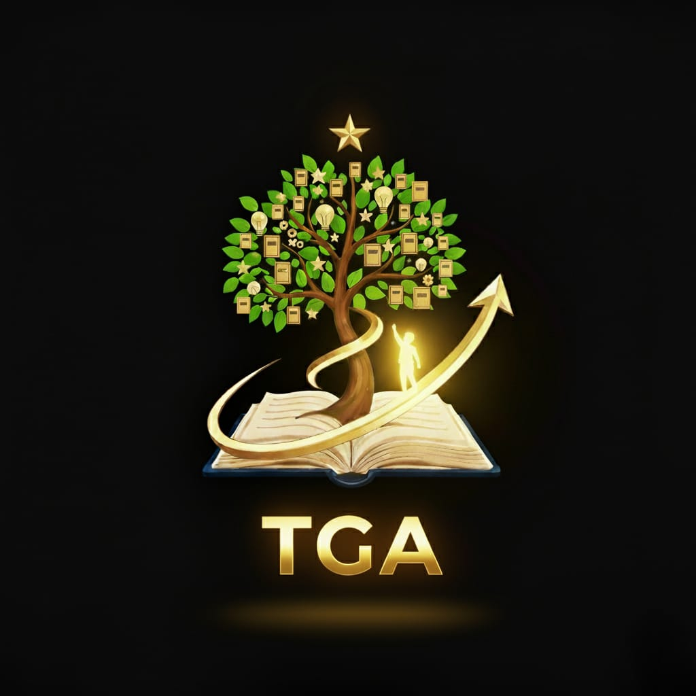

# 🚀 TGA - Tetra Guide Avenza | Modern React Website

A stunning, high-end tech education website built with React, featuring cinematic animations, glassmorphism design, and a premium user experience inspired by top tech startups.



## ✨ Features

### 🎨 Premium Design
- **Dark Futuristic Theme** - Based on TGA logo colors (Gold #D4AF37, Green #7CB342)
- **Glassmorphism Effects** - Frosted glass cards with backdrop blur
- **Gradient Animations** - Smooth color transitions and shimmer effects
- **Responsive Design** - Mobile-first approach, optimized for all devices

### 🎬 Cinematic Animations
- **Framer Motion** - Smooth page transitions and scroll animations
- **GSAP** - Advanced text reveal and timeline animations
- **Loading Screen** - Animated logo with orbiting particles
- **Scroll-triggered Effects** - Elements animate as you scroll
- **Parallax Scrolling** - Depth and motion on hero section
- **Hover Interactions** - Micro-animations on cards and buttons

### 📱 Sections

1. **Hero Section**
   - Animated badge and title with gradient text
   - Floating statistics cards
   - Smooth scroll indicator
   - Parallax background orbs

2. **About Section**
   - Mission, Vision, and Approach cards
   - Staggered animations with numbered badges
   - Interactive hover effects

3. **Programs Section**
   - 6 tech training programs with color-coded cards
   - Animated tags and icons
   - Gradient backgrounds on hover

4. **Services Section**
   - Career guidance, planning, placement, and freelancing
   - Feature lists with checkmarks
   - Animated icons and backgrounds

5. **Contact Section**
   - **Professional Email Only** (tga.tetra.guide.avenza@gmail.com)
   - Social media links (Instagram, LinkedIn)
   - Copy email functionality
   - Availability hours
   - Animated CTA card

6. **Footer**
   - Company information and links
   - Social media icons
   - Scroll-to-top button
   - Copyright information

## 🛠️ Tech Stack

- **React 18** - Modern React with hooks
- **Vite** - Lightning-fast build tool
- **Tailwind CSS** - Utility-first CSS framework
- **Framer Motion** - Production-ready animation library
- **GSAP** - Professional-grade animation platform

## 🚀 Getting Started

### Prerequisites
- Node.js (v16 or higher)
- npm or yarn

### Installation

The project is already set up! Just run:

```bash
npm run dev
```

The website will be available at **http://localhost:5173/**

### Build for Production

```bash
npm run build
```

This creates an optimized production build in the `dist` folder.

### Preview Production Build

```bash
npm run preview
```

## 🎯 Key Features Implemented

✅ **React Functional Components** - Modern hooks-based architecture
✅ **High-End Animations** - Framer Motion + GSAP
✅ **Fully Responsive** - Mobile, tablet, and desktop optimized
✅ **SEO Optimized** - Meta tags, Open Graph, and Twitter cards
✅ **Loading Screen** - Animated logo reveal
✅ **Smooth Scrolling** - Navigate between sections smoothly
✅ **Glassmorphism** - Modern frosted glass UI elements
✅ **Gradient Effects** - Dynamic color transitions
✅ **Interactive Navbar** - Hamburger menu for mobile
✅ **Scroll Animations** - Elements reveal on scroll
✅ **Hover Effects** - Micro-interactions throughout
✅ **Professional Contact** - Email only (no phone numbers)

## 🎨 Color Palette

Based on the TGA logo:

- **Gold**: #D4AF37, #FFD700, #B8860B
- **Green**: #7CB342, #8BC34A, #558B2F
- **Primary Background**: #0a0e27
- **Secondary Background**: #1a1f3a
- **Accent**: #6366f1, #818cf8

## 📧 Contact Information

**Email**: tga.tetra.guide.avenza@gmail.com

**Social Media**:
- Instagram: [@tga_tetra_guide_avenza_4](https://www.instagram.com/tga_tetra_guide_avenza_4)
- LinkedIn: [Tetra Guide Avenza](https://www.linkedin.com/in/tetra-guide-avenza-company-350a03395/)

## 📁 Project Structure

```
tga react/
├── public/
│   └── tga.jpg                 # Logo image
├── src/
│   ├── components/
│   │   ├── LoadingScreen.jsx   # Animated loading screen
│   │   ├── Navbar.jsx          # Responsive navigation
│   │   ├── Hero.jsx            # Hero section with parallax
│   │   ├── About.jsx           # About section with cards
│   │   ├── Programs.jsx        # Programs showcase
│   │   ├── Services.jsx        # Services offered
│   │   ├── Contact.jsx         # Contact information
│   │   └── Footer.jsx          # Footer with links
│   ├── App.jsx                 # Main app component
│   ├── main.jsx                # React entry point
│   └── index.css               # Global styles + Tailwind
├── index.html                  # HTML template with SEO
├── tailwind.config.js          # Tailwind configuration
├── postcss.config.js           # PostCSS configuration
├── vite.config.js              # Vite configuration
└── package.json                # Dependencies
```

## 🌟 Performance Features

- **Code Splitting** - Lazy loading for optimal performance
- **Image Optimization** - Efficient asset loading
- **CSS Purging** - Removes unused Tailwind classes
- **Fast Refresh** - Instant updates during development
- **Production Build** - Minified and optimized

## 🎓 Programs Offered

1. **Python Development** - Fundamentals to advanced
2. **Java Development** - Enterprise-grade applications
3. **AI & Machine Learning** - Neural networks and NLP
4. **Deep Learning** - CNNs, RNNs, Transformers
5. **Web Development** - Full-stack with modern frameworks
6. **Data Analytics** - Power BI, SQL, visualization

## 📱 Mobile Optimizations

- Touch-friendly navigation
- Responsive images and layouts
- Optimized animations for mobile performance
- Hamburger menu with smooth transitions
- Mobile-first CSS approach

## 🔧 Customization

All colors, animations, and content can be customized in:
- `tailwind.config.js` - Colors and theme
- `src/index.css` - Global styles and animations
- Component files - Content and structure

## 📄 License

© 2025 TGA - Tetra Guide Avenza. All Rights Reserved.

---

**Made with ❤️ for aspiring tech innovators**
